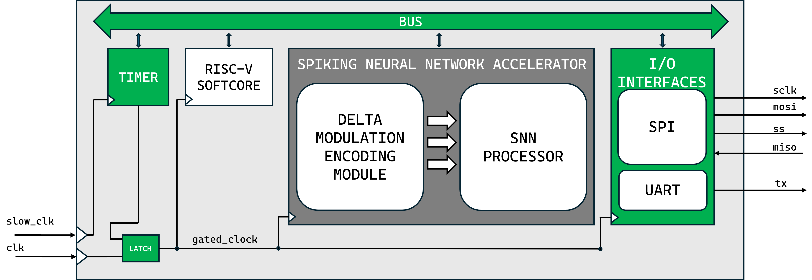
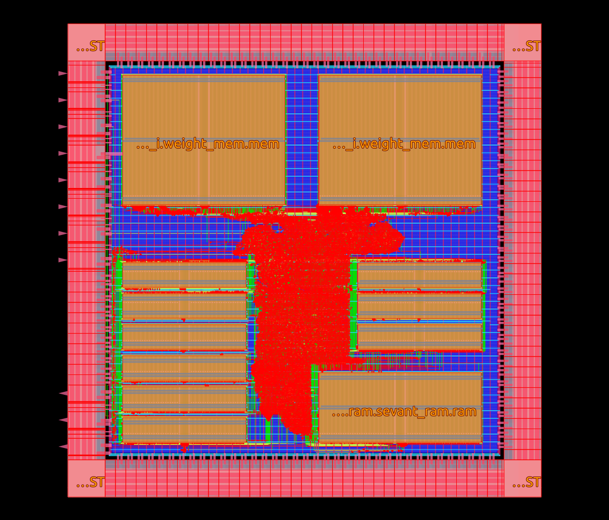

# SYNtzulA

**SYNtzulA** is the open-source ASIC implementation of **SYNtzulu**, originally developed on FPGA.

SYNtzulA is designed to provide an efficient hardware platform for spiking neural network processing, targeting ASIC-based implementations while maintaining compatibility with the original FPGA architecture.

SYNtzulA features three main modules:
- **Delta-modulation-based encoding module**: converts continuous input signals into spike trains.
- **Spiking Neural Network (SNN) accelerator**: processes the spike streams generated by the encoding module.
- **RISC-V softcore**: responsible for system management and control.



# Requirements
- SYNtzulA has been tested with the oss_cad_suite (version 2023-07-28), which can be downloaded [here](https://github.com/YosysHQ/oss-cad-suite-build/releases/tag/2023-07-28)
- RISC-V cross-compiler is required to compile the firmware. If your system does not already include it, execute the following commands or refer to the [riscv-gnu-toolchain page](https://github.com/riscv-collab/riscv-gnu-toolchain)
- Syntzula was developed using **OpenROAD Flow Scripts**
(commit [`c01383bed7ea05208642610dde3740d5d4e8394a`](https://github.com/The-OpenROAD-Project/OpenROAD-flow-scripts/commit/c01383bed7ea05208642610dde3740d5d4e8394a)).
- SYNtzulA was synthesized using **Yosys v0.46+147** (commit `2999f5589`).
- Floorplanning, placement, and routing were performed using [OpenROAD v2.0-16697](https://github.com/Precision-Innovations/OpenROAD/releases/tag/2.0-16697-gf0ccb57a7).

# RTL Simulation

The repository is already set up to allow running a test with a single command.

A ready-to-use testbench is provided, which includes a precompiled program that:
- loads the neural network weights into the accelerator,
- receives input samples through the SPI interface and feeds them to the accelerator,
- compares the inference results against the expected reference outputs to verify correct functionality.

To run the simulation, simply execute:

```bash
make simulate_service_ihp_dual_core
```
If the simulation completes successfully, you should see the inference results scrolling on the terminal.

# Set up Backend Flow 

Before running the backend flow, it is necessary to create the directories required by the OpenROAD flow scripts.

This can be done by simply executing:

```bash
make setup_orfs_folder
```
This command will populate the directory with the configuration files used by the flow, in particular:
- config.mk: general flow configuration
- service_placement.cfg: memory placement configuration
- pdn.tcl: power distribution network (PDN) settings

⚠️ Important: for the flow to work correctly, the repository must be located in a directory with the following structure:
```text
.
├── OpenROAD-flow-scripts                 
├── SyntzulA
│   ├── Makefile
```

# Backend-Flow

Once the backend flow has been set up, the only remaining step is to run it.

If you are currently in the `SYNtzulA` directory, move to the OpenROAD flow directory:

```bash
cd ../OpenROAD-flow-scripts/flow/
```
Then, execute the backend flow with the following command:

```bash
make DESIGN_CONFIG=./designs/ihp-sg13g2/SYNtzulA/config.mk
```
The final result of the backend flow is shown below.

<p align="center">
  
</p>

#Citation

If you wish to cite this work, please use the following:

```bibtex
@inproceedings{10.1145/3706594.3726979,
author = {Martis, Luca and Leone, Gianluca and Raffo, Luigi and Meloni, Paolo},
title = {SYNtzulA: Open-Source Hardware for Energy-Efficient Spiking Neural Network Inference},
year = {2025},
isbn = {9798400713934},
publisher = {Association for Computing Machinery},
address = {New York, NY, USA},
url = {https://doi.org/10.1145/3706594.3726979},
doi = {10.1145/3706594.3726979},
pages = {70–73},
numpages = {4},
keywords = {Spiking Neural Networks, Edge AI, OpenROAD, ASIC, open-source},
location = {
},
series = {CF '25 Companion}
}

