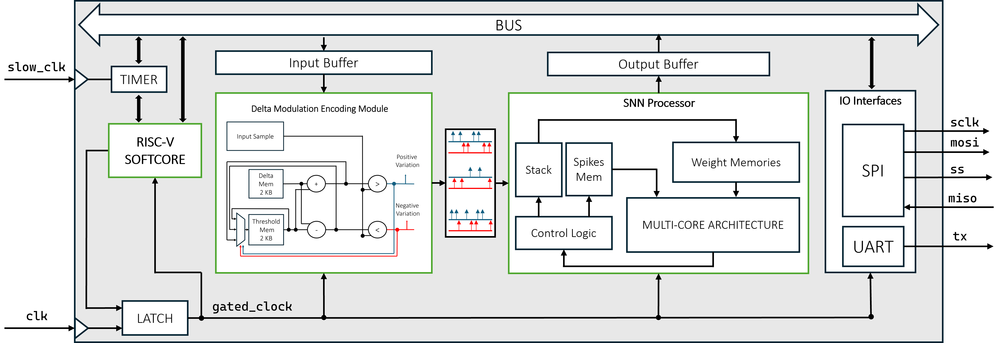
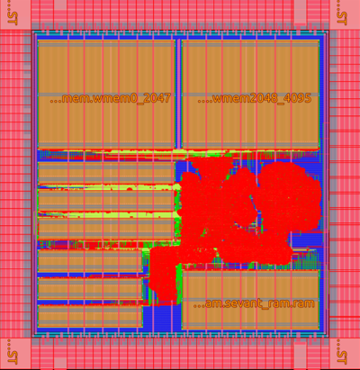
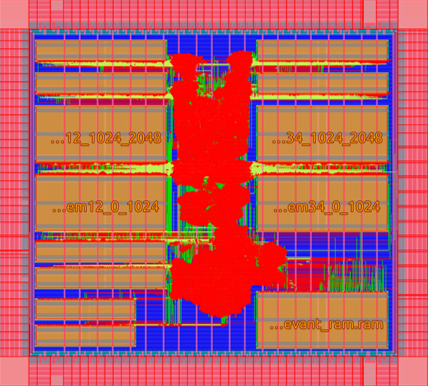

# SYNtzulA

**SYNtzulA** is the open-source ASIC implementation of **SYNtzulu**, originally developed on FPGA.

SYNtzulA is designed to provide an efficient hardware platform for spiking neural network processing, targeting ASIC-based implementations while maintaining compatibility with the original FPGA architecture.

SYNtzulA features three main modules:
- **Delta-modulation-based encoding module**: converts continuous input signals into spike trains.
- **Spiking Neural Network (SNN) accelerator**: processes the spike streams generated by the encoding module.
- **RISC-V softcore**: responsible for system management and control.

The SNN accelerator is provided in two variants: a **dual-core** and a **quad-core** version. The two share the same softcore and encoding front-end, and differ only in the number of parallel compute cores in the SNN engine. Each variant is built, simulated, and physically implemented through its own set of Makefile targets (`*_dual_core` / `*_quad_core`).



## Requirements

Different tools are used for the front-end (simulation) and the back-end (synthesis, place & route) steps:

- **RISC-V cross-compiler** (`riscv32-unknown-elf-`) — required to build the firmware. If your system does not already include it, refer to the [riscv-gnu-toolchain page](https://github.com/riscv-collab/riscv-gnu-toolchain).
- **Simulation** — tested with the **oss-cad-suite (2023-07-28)**, which provides the `iverilog`/`vvp` tools. It can be downloaded [here](https://github.com/YosysHQ/oss-cad-suite-build/releases/tag/2023-07-28).
- **Synthesis** — performed with **Yosys 0.52+50** (git sha1 `c894685f2`), as bundled in the **oss-cad-suite (2025-04-16)**

- **Floorplanning, placement, and routing** — performed with **OpenROAD 2.0-17598-ga008522d8** (Ubuntu 20.04).

- **Back-end flow** — driven by **OpenROAD Flow Scripts**, tag **`v3.0-2835-geec75094`** (HEAD `eec75094`, 15 April 2025).

> ⚠️ **Note — local modifications to OpenROAD Flow Scripts**
>
> The back-end flow was run against a checkout of OpenROAD Flow Scripts with **two lines commented out**. If you reproduce the flow from a clean checkout, be aware of these changes as they may affect the behavior you observe:
>
> - `flow/scripts/open.tcl` — the line setting the GUI title is commented out:
>   ```tcl
>   #gui::set_title "OpenROAD - $::env(PLATFORM)/$::env(DESIGN_NICKNAME)/$::env(FLOW_VARIANT) - ${db_basename}"
>   ```
> - `flow/scripts/write_ref_sdc.tcl` — the final endpoint-count info message is commented out:
>   ```tcl
>   #utl::info "FLW" 11 "Path endpoint path count [sta::endpoint_path_count]"
>   ```

## Firmware

The repository ships with a precompiled firmware, so the simulations below can be run out of the box. To rebuild it (e.g. after editing the C sources), select an application and compile it:

```bash
cd firmware
make compile app=emg
```

This copies the chosen application from `firmware/src/applications/<app>` into `src/` and produces `exe.hex` and `exe_ROM.txt`, which are loaded by the testbench.

## RTL simulation

A ready-to-use testbench is provided, which includes a program that:
- loads the neural network weights into the accelerator,
- receives input samples through the SPI interface and feeds them to the accelerator,
- compares the inference results against the expected reference outputs to verify correct functionality.

Run the RTL simulation for the desired accelerator variant:

```bash
make simulate_dual_core     # dual-core variant
make simulate_quad_core     # quad-core variant
```

If the simulation completes successfully, the inference results are printed on the terminal.

## Gate-level simulation

The same testbench can be run against the synthesized netlist (**post-synthesis**) or the final routed netlist (**post-layout**). These targets automatically copy the netlist out of the OpenROAD results, preload the delta-modulator memory (to be fixed), and then simulate — so they require the back-end flow (below) to have been run first for the corresponding variant.

**Post-synthesis** (uses `1_synth.v`):

```bash
make simulate_service_ihp_dual_core_PostSintesi
make simulate_service_ihp_quad_core_PostSintesi
```

**Post-layout** (uses `6_final.v`):

```bash
make simulate_service_ihp_dual_core_PostLayout
make simulate_service_ihp_quad_core_PostLayout
```

## Set up the back-end flow

Before running the flow, the design directory required by OpenROAD Flow Scripts must be created and populated with the configuration files. Point `OPENROAD_PATH` to your OpenROAD Flow Scripts checkout and run:

```bash
make setup_orfs OPENROAD_PATH=/path/to/OpenROAD-flow-scripts
```

This creates `designs/ihp-sg13g2/SYNtzulA/` inside the flow and copies, for both variants:
- `config_dual_core.mk` / `config_quad_core.mk` — general flow configuration (with the RTL paths resolved to this repository);
- `dual_core/` and `quad_core/` — per-variant constraints (`constraint_*.sdc`), memory placement (`placement_*.cfg`), power distribution network (`pdn_*.tcl`), and pad ring (`pad_*.tcl`).

If `OPENROAD_PATH` is omitted, the default set in the `Makefile` is used.

## Run the back-end flow

Once the setup is done, move to the OpenROAD flow directory and launch the flow for the desired variant:

```bash
cd /path/to/OpenROAD-flow-scripts/flow
make DESIGN_CONFIG=./designs/ihp-sg13g2/SYNtzulA/config_dual_core.mk   # or config_quad_core.mk
```

The final layout can be inspected in the GUI with:

```bash
make DESIGN_CONFIG=./designs/ihp-sg13g2/SYNtzulA/config_dual_core.mk gui_final
```

The final layouts of the two variants are shown below.

| Dual-core | Quad-core |
|:---:|:---:|
|  |  |

## Citation

If you wish to cite this work, please use the following:

```bibtex
@ARTICLE{11303250,
  author={Martis, Luca and Leone, Gianluca and Raffo, Luigi and Meloni, Paolo},
  journal={IEEE Transactions on Computer-Aided Design of Integrated Circuits and Systems}, 
  title={SYNtzulA: Open Hardware for Near-Sensor SNN Inference}, 
  year={2025},
  volume={},
  number={},
  pages={1-1},
  keywords={Neuromorphics;Energy efficiency;Field programmable gate arrays;Hardware;Throughput;Computer architecture;Power demand;Program processors;Energy consumption;Spiking neural networks;Spiking Neural Networks;Open Hardware;ASIC;Low Power},
  doi={10.1109/TCAD.2025.3645186}}
}
```
