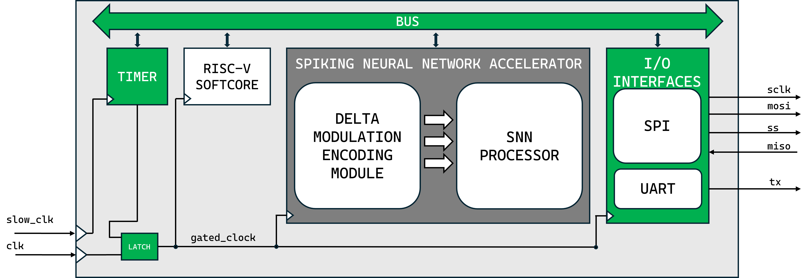
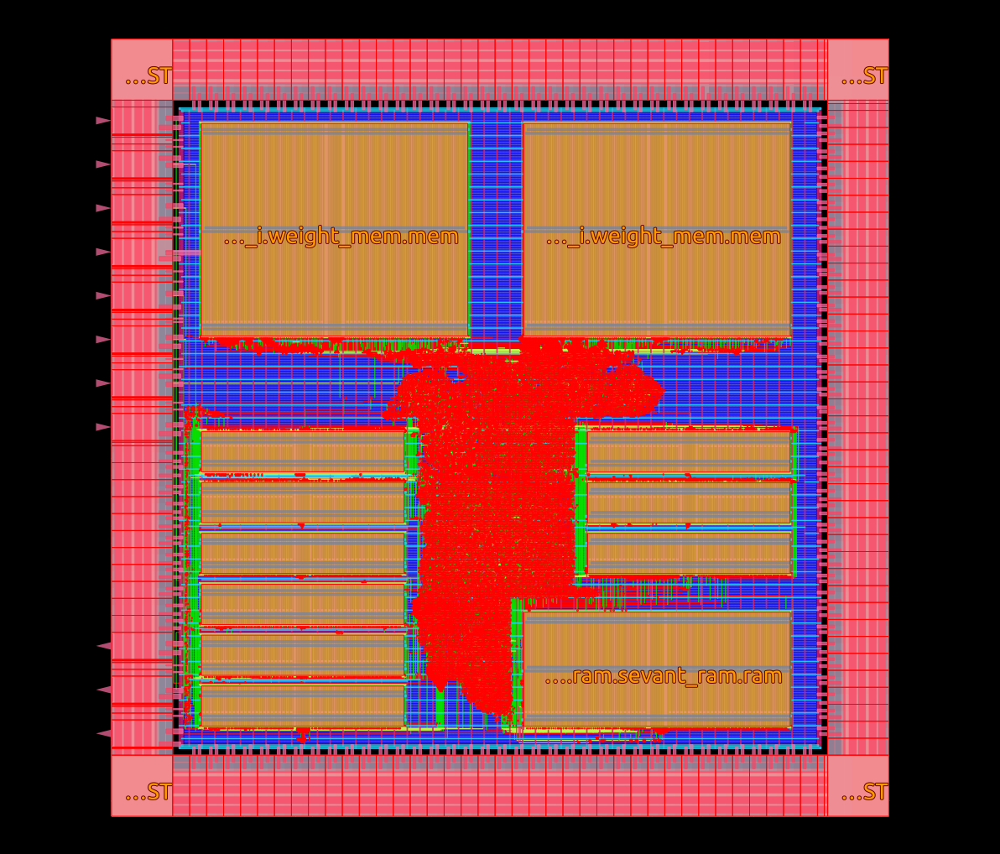

# SYNtzulA

**SYNtzulA** is the open-source ASIC implementation of **SYNtzulu**, originally developed on FPGA.

SYNtzulA is designed to provide an efficient hardware platform for spiking neural network processing, targeting ASIC-based implementations while maintaining compatibility with the original FPGA architecture.

SYNtzulA features three main modules:
- **Delta-modulation-based encoding module**: converts continuous input signals into spike trains.
- **Spiking Neural Network (SNN) accelerator**: processes the spike streams generated by the encoding module.
- **RISC-V softcore**: responsible for system management and control.

The accelerator is provided in two variants, a **dual-core** and a **quad-core** version, selectable through the corresponding Makefile targets.



## Requirements

- SYNtzulA has been tested with the oss_cad_suite (version 2023-07-28), which can be downloaded [here](https://github.com/YosysHQ/oss-cad-suite-build/releases/tag/2023-07-28). It provides the `iverilog`/`vvp` tools used for simulation.
- A RISC-V cross-compiler (`riscv32-unknown-elf-`) is required to build the firmware. If your system does not already include it, refer to the [riscv-gnu-toolchain page](https://github.com/riscv-collab/riscv-gnu-toolchain).
- SYNtzulA was developed using **OpenROAD Flow Scripts** (commit [`c01383bed7ea05208642610dde3740d5d4e8394a`](https://github.com/The-OpenROAD-Project/OpenROAD-flow-scripts/commit/c01383bed7ea05208642610dde3740d5d4e8394a)).
- Synthesis was performed with **Yosys v0.46+147** (commit `2999f5589`).
- Floorplanning, placement, and routing were performed using [OpenROAD v2.0-16697](https://github.com/Precision-Innovations/OpenROAD/releases/tag/2.0-16697-gf0ccb57a7).

## Repository layout

| Directory | Content |
|-----------|---------|
| `rtl/serv`, `rtl/servant` | RISC-V softcore (SERV) and the SoC around it (UART, SPI, GPIO, timer, accelerator interface) |
| `rtl/syntzulu_dual_core`, `rtl/syntzulu_quad_core` | SNN accelerator, dual-core and quad-core variants |
| `rtl/memorie_ihp`, `rtl/behavioural_ihp` | IHP SG13G2 SRAM models |
| `firmware` | Bare-metal C firmware executed by the softcore |
| `sim` | Testbenches (`tb`), memory stimuli (`mem`), and reference/produced results |
| `orfs_setup` | OpenROAD configuration (per-core `config_*.mk` and `dual_core/`, `quad_core/` folders) |
| `ORFS_netlist` | Post-synthesis / post-layout netlists (regenerated by the flow) |

## Firmware

The repository ships with a precompiled firmware, so simulation can be run out of the box. To rebuild it (e.g. after modifying the C sources), select an application and compile it:

```bash
cd firmware
make compile app=emg
```

This copies the chosen application from `firmware/src/applications/<app>` into `src/` and produces `exe.hex` and `exe_ROM.txt`, which are loaded by the testbench.

## RTL Simulation

A ready-to-use testbench is provided, which includes a program that:
- loads the neural network weights into the accelerator,
- receives input samples through the SPI interface and feeds them to the accelerator,
- compares the inference results against the expected reference outputs to verify correct functionality.

To run the RTL simulation, choose the accelerator variant:

```bash
make simulate_dual_core     # dual-core variant
make simulate_quad_core     # quad-core variant
```

If the simulation completes successfully, the inference results are printed on the terminal.

## Gate-level simulation

The same testbench can be run against the synthesized netlist (post-synthesis) or the final routed netlist (post-layout). These targets automatically copy the netlist out of the OpenROAD results and preload the delta-modulator memory before simulating, so they require the backend flow (below) to have been run first.

```bash
# Post-synthesis (1_synth.v)
make simulate_service_ihp_dual_core_PostSintesi
make simulate_service_ihp_quad_core_PostSintesi

# Post-layout (6_final.v)
make simulate_service_ihp_dual_core_PostLayout
make simulate_service_ihp_quad_core_PostLayout
```

## Set up the backend flow

Before running the backend flow, the design directory required by the OpenROAD flow scripts must be created and populated with the configuration files. Point `OPENROAD_PATH` to your OpenROAD Flow Scripts checkout and run:

```bash
make setup_orfs OPENROAD_PATH=/path/to/OpenROAD-flow-scripts
```

This creates `designs/ihp-sg13g2/SYNtzulA/` inside the flow and copies, for each variant:
- `config_dual_core.mk` / `config_quad_core.mk` — general flow configuration (with the RTL paths resolved to this repository),
- `dual_core/` and `quad_core/` — per-variant constraints (`constraint_*.sdc`), memory placement (`placement_*.cfg`), power distribution network (`pdn_*.tcl`), and pad ring (`pad_*.tcl`).

If `OPENROAD_PATH` is omitted, the default set in the `Makefile` is used.

## Run the backend flow

Once the setup is done, move to the OpenROAD flow directory and launch the flow for the desired variant:

```bash
cd /path/to/OpenROAD-flow-scripts/flow
make DESIGN_CONFIG=./designs/ihp-sg13g2/SYNtzulA/config_dual_core.mk   # or config_quad_core.mk
```

The final layout can be inspected in the GUI with:

```bash
make DESIGN_CONFIG=./designs/ihp-sg13g2/SYNtzulA/config_dual_core.mk gui_final
```

The final result of the backend flow is shown below.

<p align="center">
  
</p>

## Citation

If you wish to cite this work, please use the following:

```bibtex
@inproceedings{10.1145/3706594.3726979,
author = {Martis, Luca and Leone, Gianluca and Raffo, Luigi and Meloni, Paolo},
title = {SYNtzulA: Open-Source Hardware for Energy-Efficient Spiking Neural Network Inference},
year = {2025},
isbn = {9798400713934},
publisher = {Association for Computing Machinery},
address = {New York, NY, USA},
url = {https://doi.org/10.1145/3706594.3726979},
doi = {10.1145/3706594.3726979},
pages = {70–73},
numpages = {4},
keywords = {Spiking Neural Networks, Edge AI, OpenROAD, ASIC, open-source},
location = {},
series = {CF '25 Companion}
}
```
